---
## Author
author:
  name: А. Атанесов, А. Понич, В. Ефремова, А. Касьянов, Б. Тогтохжаф, Д. Дроздова
  affiliation:
    - name: Российский университет дружбы народов
      country: Российская Федерация
      postal-code: 117198
      city: Москва
      address: ул. Миклухо-Маклая, д. 6

## Title
title: Отчёт по лабораторной работе № 1
subtitle: Команда реагирования и анализ инцидента безопасности
license: CC BY
date: today
date-format: "YYYY-MM-DD"
---

# Вводная часть

## Актуальность

- Реагирование на инциденты информационной безопасности — ключевая задача защиты инфраструктуры.  
- От слаженных действий команды зависит минимизация ущерба и предотвращение повторных атак.  
- Практика анализа инцидентов необходима специалистам по кибербезопасности.  

## Цель работы

Познакомиться с процессом реагирования на инцидент информационной безопасности, научиться анализировать события в логах, выявлять вредоносную активность и применять меры по устранению уязвимостей.

## Задания

1. Провести анализ логов системы на предмет признаков компрометации.  
2. Определить источник инцидента и зафиксировать последовательность действий злоумышленника.  
3. Разработать и применить меры реагирования для изоляции заражённой системы и устранения уязвимости.  
4. Подготовить отчёт о ходе реагирования.

# Ход работы

## Теоретическое введение

Команда реагирования на инциденты (Incident Response Team) выполняет задачи по:
- обнаружению, анализу, локализации и устранению последствий инцидентов ИБ;
- реагированию в рамках цикла *обнаружение → анализ → изоляция → устранение → документирование*.

Ключевые события Windows:
- **4624** — успешный вход в систему;  
- **4688** — запуск процесса;  
- **5379** — запрос учётных данных.  

## Обнаружение и анализ событий

- **Event 5379** — чтение паролей из памяти.  
- **Event 4624** — множественные успешные входы.  
- **Event 4688** — всплеск запусков процессов.  

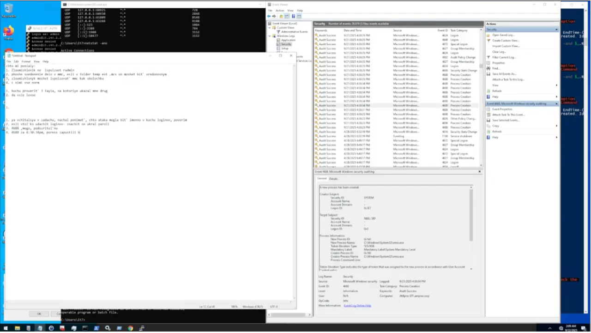

- Установлено: атака через уязвимость **CVE-2021-44228 (Log4Shell)** в **Redmine**.

## Идентификация вредоносного процесса

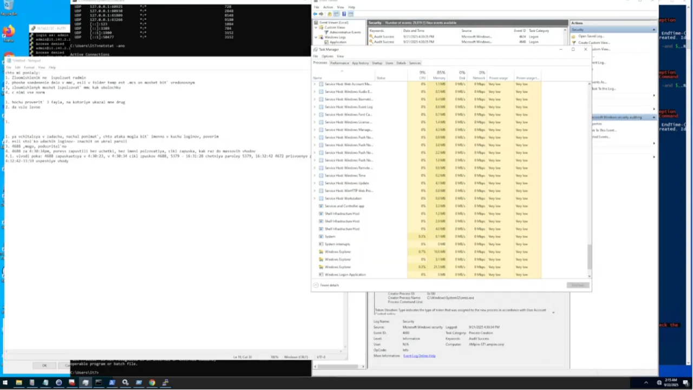

- Обнаружен процесс **amss.exe**:  
  - запуск без идентификации (NULL SID);  
  - самопорождение через 11 секунд;  
  - признаки бекдора.  

## Проверка системных компонентов

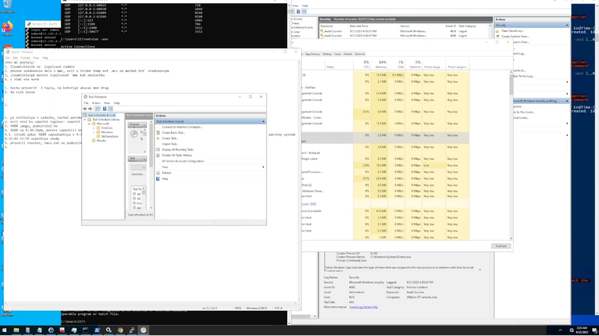

- Диспетчер служб — чисто.  
- Разделы автозагрузки — без вредоносных записей.  
- Планировщик задач — без подозрительных скриптов.  

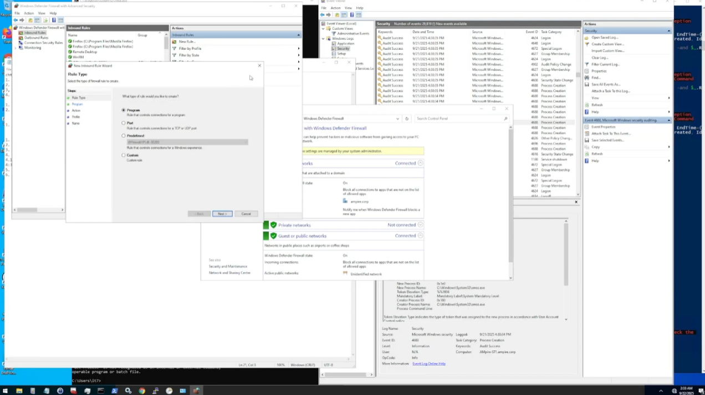

## Устранение уязвимости

- Обновлён **Redmine (10.10.2.15)** до 5.0.0+.  
- При невозможности обновления — закрыт внешний доступ.  
- Настроен **Windows Defender Firewall**:
  - блок портов **80/443** извне;
  - разрешён доступ из 10.10.0.0/16.  

## Изоляция системы

- Система **10.10.2.15** изолирована от сети.  
- Блокирована связь с C2-сервером **195.238.174.11**.  
- Созданы правила блокировки входящих TCP-соединений.  

## Очистка и восстановление

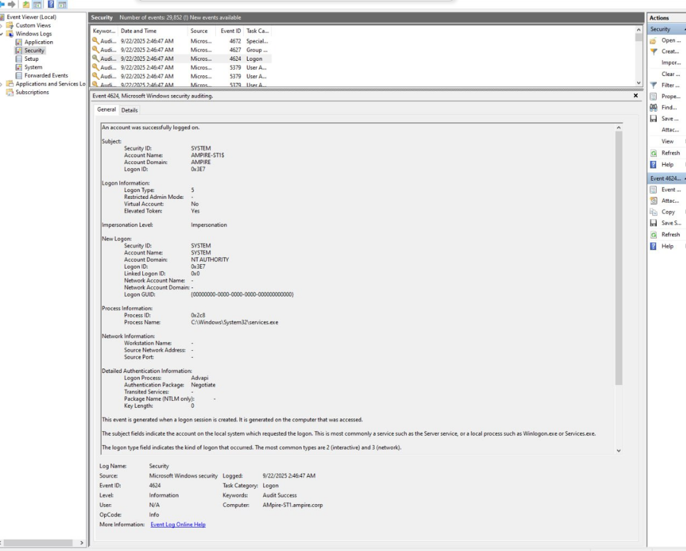
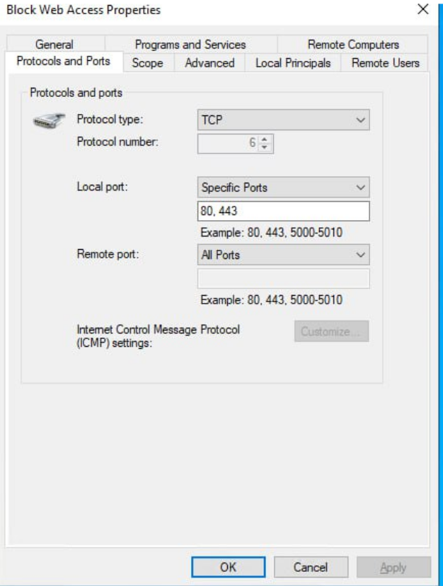
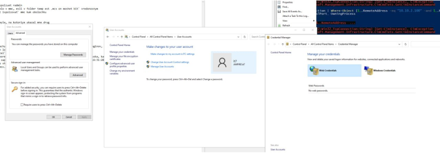
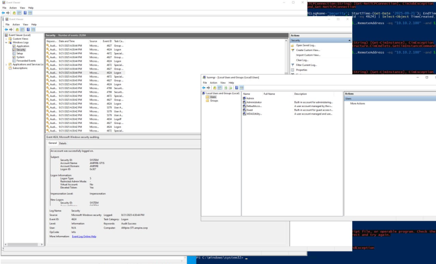
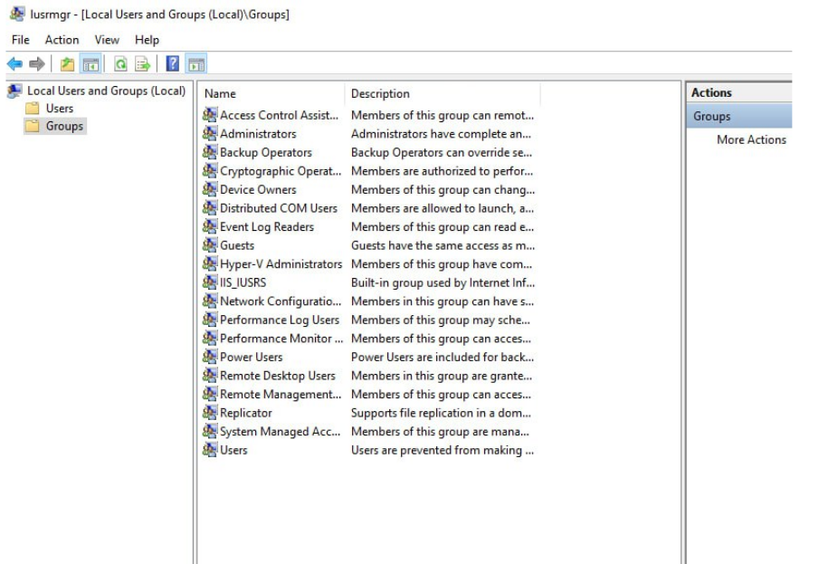
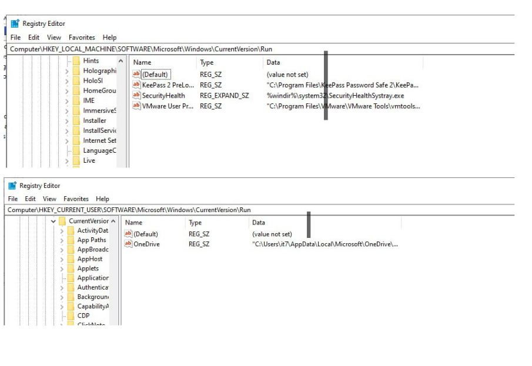

- Удалены заражённые учётные данные.  
- Удалены вредоносные пользователи и процессы.  
- Пересозданы пароли для Radmin и системных аккаунтов.  

## Действия команды мониторинга

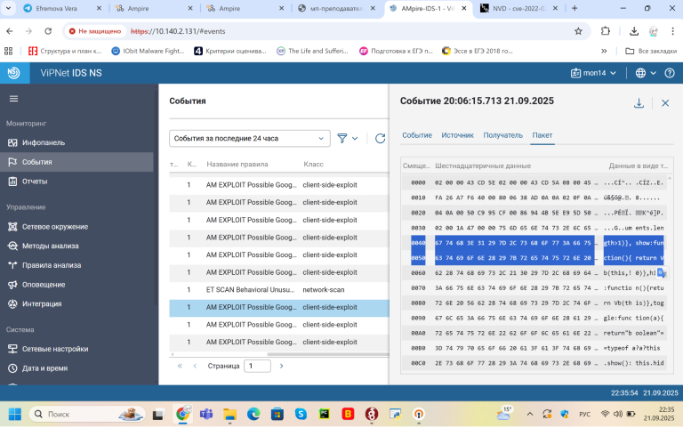

- Построена **цепочка атаки**.  
- Определена **география источников**.  
- Логи проанализированы, уязвимость внесена в базу.  
- Настроен постоянный мониторинг.  

# Результаты

## Итоги работы

- Подтверждена эксплуатация **CVE-2021-44228**.  
- Определён вредоносный процесс **amss.exe**.  
- Заражённый узел изолирован, угрозы устранены.  
- Усилены политики безопасности и сетевой периметр.  

## Выводы

- Отработаны практические навыки реагирования на инциденты.  
- Налажен цикл: **обнаружение → анализ → локализация → восстановление → отчётность**.  
- Подтверждена эффективность координированных действий команды.  

# Список литературы{.unnumbered}

::: {#refs}
:::

