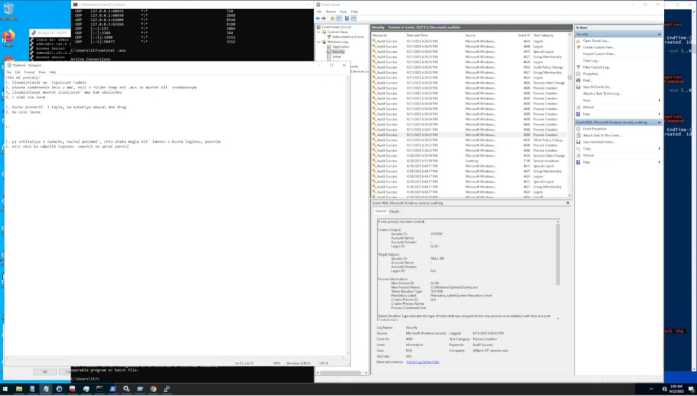
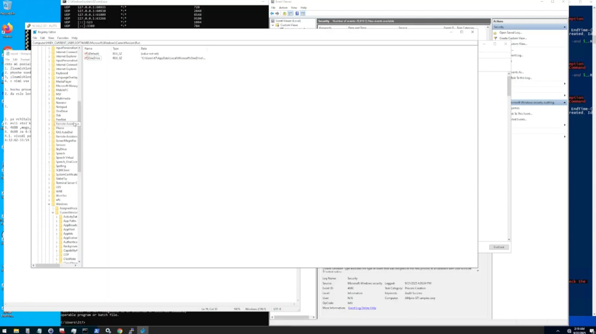
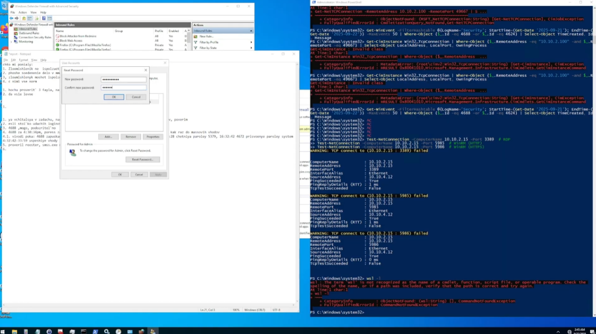
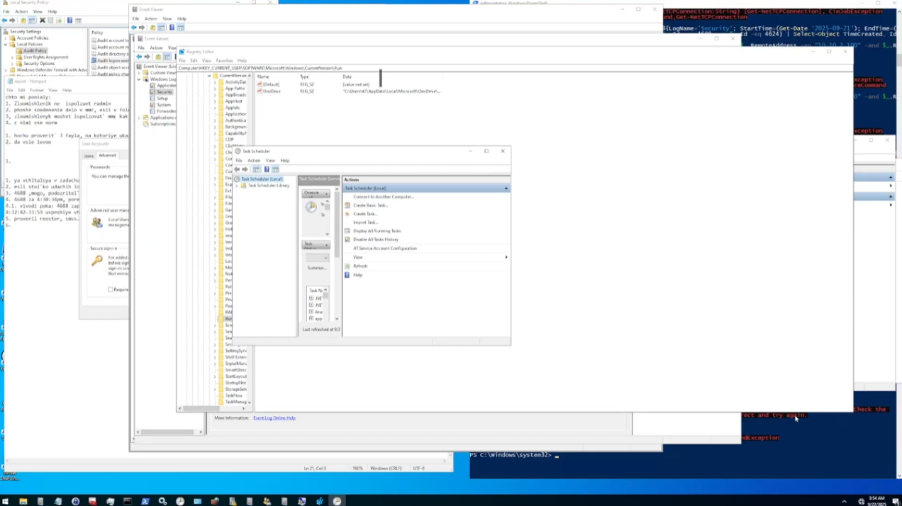
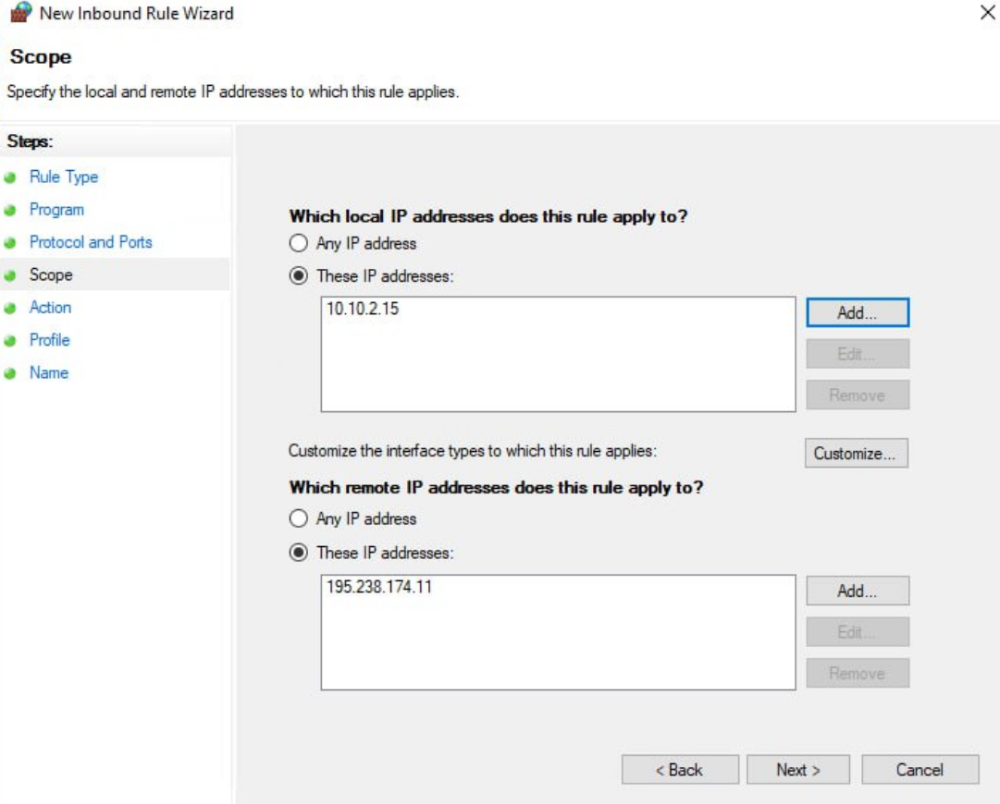
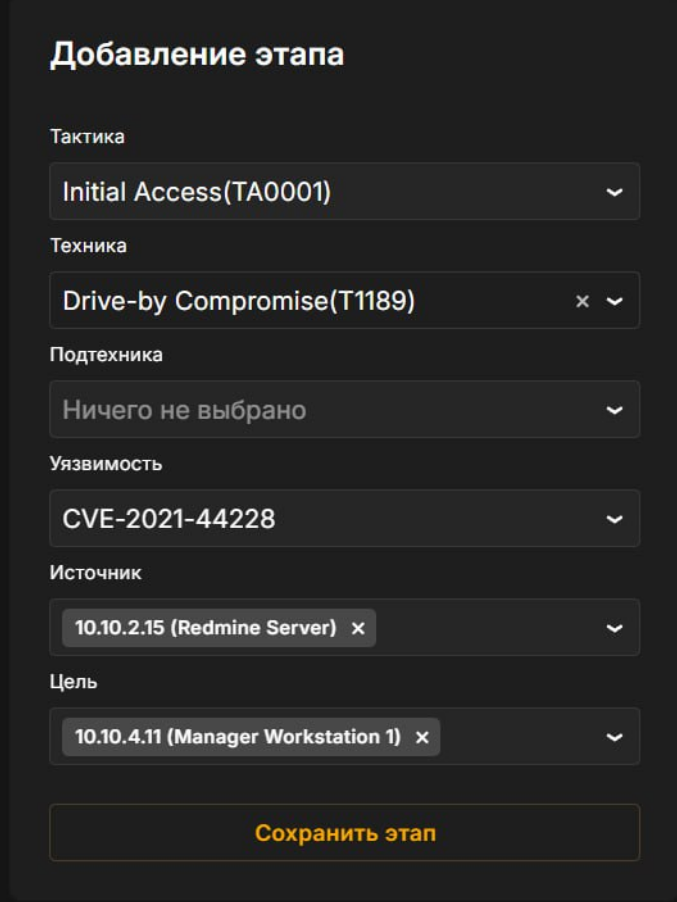
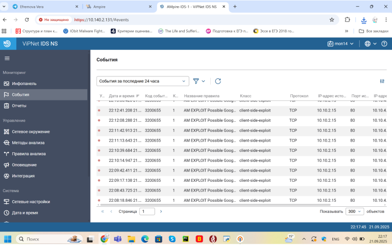
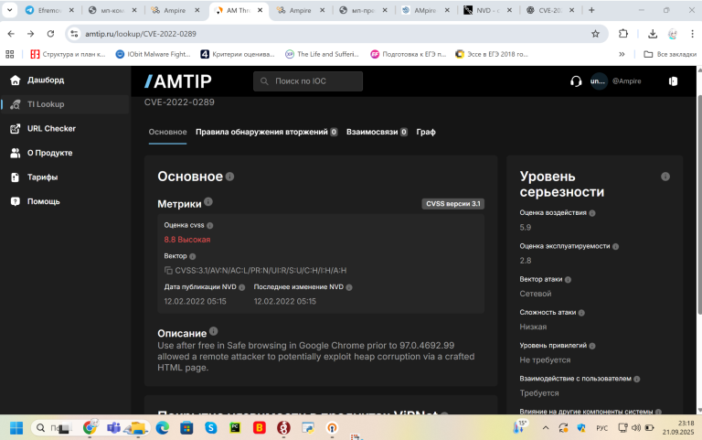
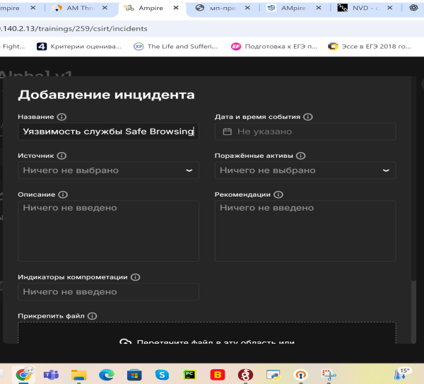

---
## Author
author:
  name: А. Атанесов, А. Понич, В. Ефремова, А. Касьянов, Б. Тогтохжаф, Д. Дроздова
  affiliation:
    - name: Российский университет дружбы народов
      country: Российская Федерация
      postal-code: 117198
      city: Москва
      address: ул. Миклухо-Маклая, д. 6

## Title
title: "Отчёт по лабораторной работе №1"
subtitle: "Команда реагирования и анализ инцидента безопасности"
license: "CC BY"
---

# Цель работы

Познакомиться с процессом реагирования на инцидент информационной безопасности, научиться анализировать события в логах, выявлять вредоносную активность и применять меры по устранению уязвимостей.

# Задание

1. Провести анализ логов системы на предмет признаков компрометации.  
2. Определить источник инцидента и зафиксировать последовательность действий злоумышленника.  
3. Разработать и применить меры реагирования для изоляции заражённой системы и устранения уязвимости.  
4. Подготовить отчёт о ходе реагирования.

# Теоретическое введение

Команда реагирования на инциденты (Incident Response Team) выполняет задачи по обнаружению, анализу, локализации и устранению последствий инцидентов информационной безопасности.  
Основные этапы реагирования включают:
- **Обнаружение и регистрация** инцидента;
- **Анализ** логов и системных событий;
- **Изоляция** скомпрометированных узлов;
- **Устранение** уязвимости и восстановление системы;
- **Документирование** инцидента.

Для анализа часто используются события безопасности Windows (например, 4624, 4688, 5379), отражающие попытки входа, запуск процессов и доступ к ресурсам.

# Выполнение лабораторной работы

## 1. Обнаружение и анализ событий

Команда реагирования выявила подозрительные записи:

- **Event 5379** — чтение паролей из памяти;
- **Event 4624** — множественные успешные входы с украденными учётными данными;

- **Event 4688** — многочисленные запуски процессов, что указывает на активность вредоносного ПО.

Выяснено, что злоумышленник получил доступ через **уязвимость CVE-2021-44228 (Log4Shell)** в системе **Redmine**, запущенной под учетной записью SYSTEM.

## 2. Идентификация вредоносного процесса

Обнаружен процесс **amss.exe**, выполняющий подозрительное поведение:
- запущен без идентификации (NULL SID);
- через 11 секунд создаёт собственную копию;
- характерен для бекдора, обеспечивающего устойчивость злоумышленника.

## 3. Проверка системных компонентов

- Проверен **диспетчер служб** — подозрительных процессов, запущенных системными службами, не обнаружено.  
- Изучены **разделы автозагрузки** реестра — вредоносных записей не найдено.  

- Проверены **планировщики задач** — следов скриптов нет.

## 4. Устранение уязвимости

- Обновлена уязвимая система **Redmine Server (10.10.2.15)** до версии **5.0.0+**, где устранена CVE-2021-44228.  
- Если обновление невозможно — доступ к серверу из интернета отключён.  
- Настроен **Windows Defender Firewall**:
  - создано правило **Inbound Rule**;
  - порты **80 (HTTP)** и **443 (HTTPS)** блокированы для внешней сети;
  - разрешён доступ только внутри подсети **10.10.0.0/16**.

## 5. Изоляция заражённой системы

Система **10.10.2.15** изолирована от сети, чтобы предотвратить связь с командным сервером злоумышленника (**195.238.174.11**).

## 6. Дополнительный анализ

Команда обнаружила дополнительные аномалии, указывающие на:
- попытки горизонтального перемещения по сети;
- использование системных учётных записей;
- несанкционированный доступ к ресурсам с повышенными привилегиями.

Создано правило блокировки всех внешних подключений по TCP-портам 80 и 443.

## 7. Очистка и восстановление

- Удалены все сохранённые данные из заражённых учётных записей.  
- Найдены и удалены подозрительные пользователи.  
- Завершены и удалены вредоносные процессы.  
- Установлены новые пароли для Radmin и других системных учётных записей.

## 8. Действия команды мониторинга

Команда мониторинга:

- проверила **кибер-карту** для определения географии атаки;
- составила **цепочку кибератаки**;
- проанализировала логи, выявила повреждённые пакеты;
- внесла найденную уязвимость в базу для последующего анализа и устранения.

# Выводы

В ходе лабораторной работы была смоделирована ситуация реагирования на киберинцидент.  
Команда выявила следы эксплуатации уязвимости **CVE-2021-44228**, определила вредоносную активность процесса **amss.exe**, изолировала заражённую систему и устранила угрозу.  
Были приняты меры по обновлению ПО, настройке брандмауэра, очистке системы и усилению защиты.  
Работа позволила на практике закрепить навыки анализа событий безопасности и реагирования на инциденты.

# Список литературы{.unnumbered}

::: {#refs}

:::

