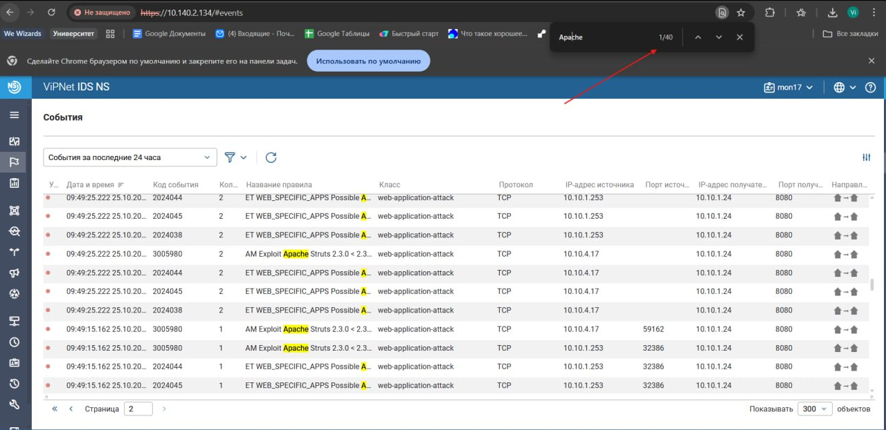
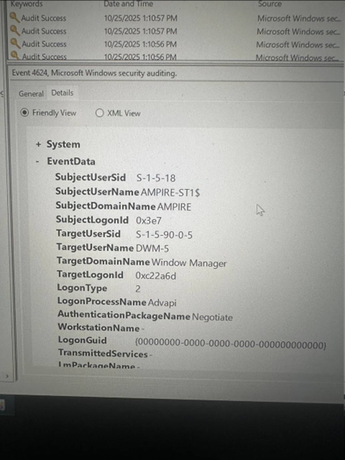
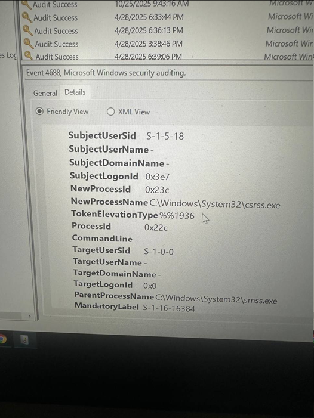
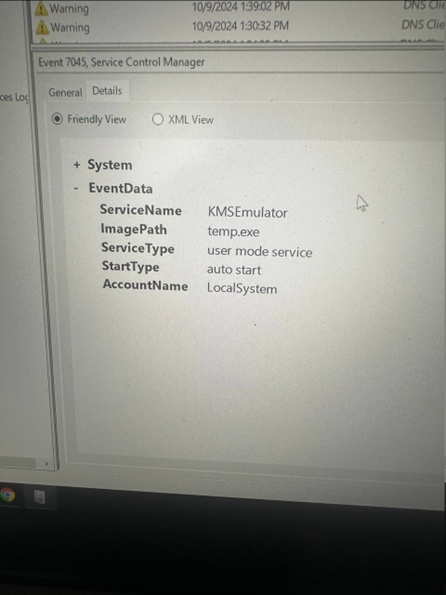
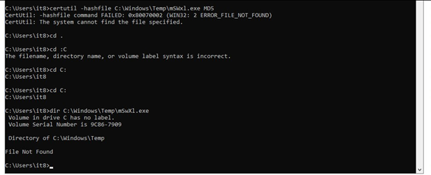
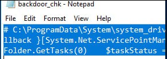
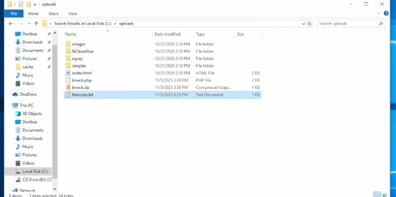
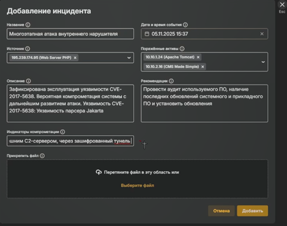

---
## Author

author:
  name: А. Атанесов, А. Понич, В. Ефремова, А. Касьянов, Б. Тогтохжаф, Д. Дроздова
  affiliation:
    - name: Российский университет дружбы народов
      country: Российская Федерация
      postal-code: 117198
      city: Москва
      address: ул. Миклухо-Маклая, д. 6

## Title

title: Отчёт по лабораторной работе № 3
subtitle: Команда реагирования и анализ инцидента безопасности
license: CC BY
date: today
date-format: "YYYY-MM-DD"
---

# Вводная часть

## Актуальность

* Реагирование на инциденты ИБ — ключ к снижению ущерба и предотвращению повторных атак.
* Практика IR отрабатывает координацию действий и применение технических мер.
* В работе исследуется многоэтапная атака на корпоративный портал (Struts2 → CMS).

## Цель работы

Познакомиться с процессом реагирования на инцидент ИБ: анализ логов, выявление вредоносной активности и применение мер по устранению уязвимостей и закрепления злоумышленника.

## Задания

1. Проанализировать логи и зафиксировать признаки компрометации.
2. Определить источник/вектор атаки и последовательность действий злоумышленника.
3. Реализовать меры реагирования для изоляции/очистки и устранения уязвимостей.
4. Подготовить отчёт о ходе реагирования.

# Ход работы

## Теоретическое введение

Команда IR действует по циклу: обнаружение -> анализ -> изоляция -> устранение -> документирование.
В Windows-журналах безопасности ключевые события:

* 4624 — успешный вход; 4672 — выдача «особых» привилегий;
* 4688 — создание процесса; 7045 — создание службы.

## Обнаружение и анализ событий

* ViPNet IDS NS: множественные срабатывания по Apache Struts2 на 10.10.1.24:8080 (источники 10.10.1.253/10.10.1.47).

* ViPNet TIAS: карточка инцидента — эксплуатация CVE-2017-5638 (Jakarta Multipart) через заголовок Content-Type -> RCE.

* TIAS — рекомендации: аудит и установка актуальных обновлений системного и прикладного ПО.

* Регистрация инцидента: источник 195.239.174.95, активы 10.10.1.24 (Tomcat) и 10.10.2.16 (CMS Made Simple), IOC — связь с внешним C2 (шифрованный туннель).

## Анализ узла CMS (Windows)

* 4624: успешный вход (LogonType=2), инициатор winlogon.exe.

* 4672: выдача привилегий (учётная запись it5) — SeDebug, SeImpersonate, SeLoadDriver, SeTakeOwnership и др.

* 4688: аудит процессов активен (цепочка smss.exe -> csrss.exe).

* 7045: создана служба KMSEmulator (ImagePath=temp.exe, автозапуск, LocalSystem) — признак персистентности.

* Проверка индикаторного файла `C:\Windows\Temp\mSWxl.exe` — отсутствует.

## Доказательства компрометации CMS и сеть

* CMSMS Admin Log: неудачный логин admin, загрузка/распаковка knock.zip, вход user — соответствует CVE-2018-10515 (Unpack в uploads).

* В `…\uploads\` обнаружены knock.php, knock.zip, подготовлен htaccess.txt.

* .htaccess: RedirectMatch 403 `\.php$` — блокируем выполнение PHP в uploads.

* netstat -bno: соединения `httpd.exe, winlogbeat.exe`; следы внешнего IP 195.239.174.12:443 (*IOC*).

* taskkill /f /pid 7120 — активная сессия/туннель принудительно завершён.

## Устранение уязвимостей и укрепление

* Установлено обновление KB4525237 (Standalone Installer) — закрытие LPE.

* SSH к 10.10.2.16:22 — отказ (Windows error 10061) уменьшена внешняя поверхность доступа.

Дополнительно (по методичке):

* отключён struts2-showcase в Tomcat Manager;
* включён Secure Jakarta Multipart parser (фикс CVE-2017-5638).

# Результаты

## Итоги работы

* Подтверждена эксплуатация CVE-2017-5638 (Struts2) и компрометация CMSMS через CVE-2018-10515.
* На узле выявлены признаки повышения привилегий и персистентности (служба KMSEmulator).
* Активная сессия прекращена, выполнены блокировки (.htaccess) и установлены патчи (KB4525237).
* Инцидент зарегистрирован и актуализирован в ViPNet TIAS.

## Выводы

* Отработан полный цикл IR на реальном сценарии.
* Применены как сетевые, так и хостовые меры защиты.
* Получены практические навыки корреляции событий IDS/TIAS и журналов Windows, а также технического устранения последствий.

