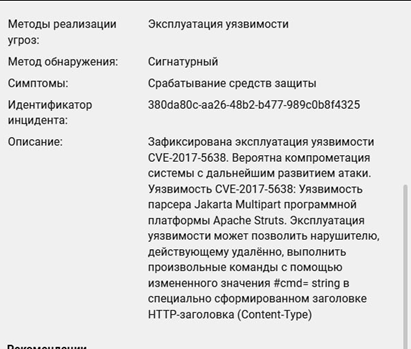
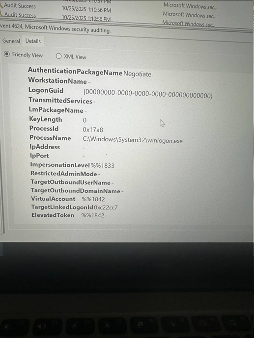
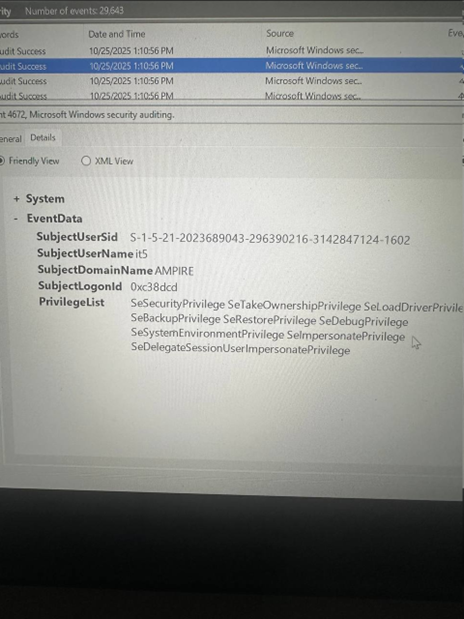
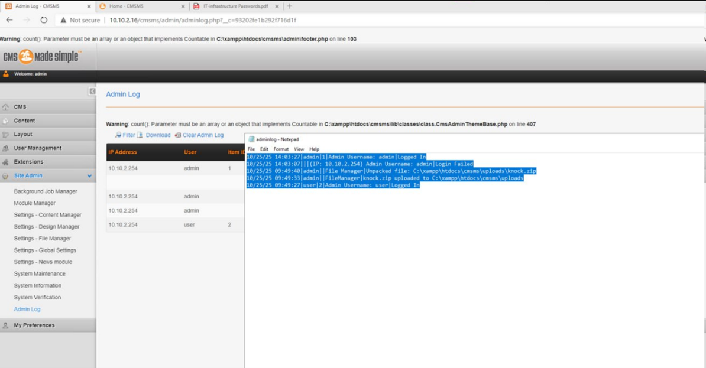
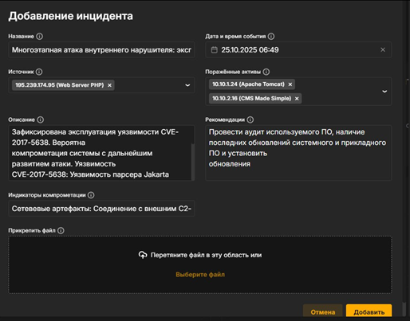
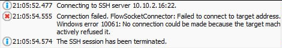
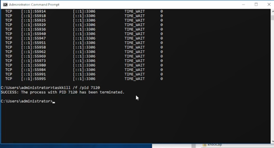
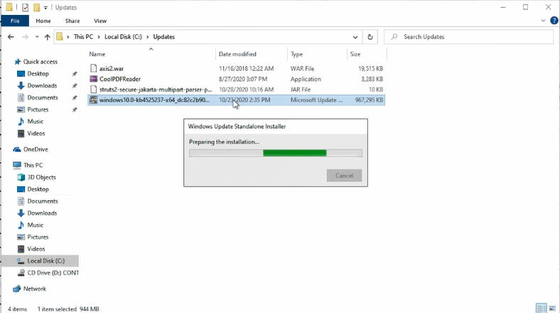

---
## Author
author:
  name: А. Атанесов, А. Понич, В. Ефремова, А. Касьянов, Б. Тогтохжаф, Д. Дроздова
  affiliation:
    - name: Российский университет дружбы народов
      country: Российская Федерация
      postal-code: 117198
      city: Москва
      address: ул. Миклухо-Маклая, д. 6

## Title
title: "Отчёт по лабораторной работе №3"
subtitle: "Команда реагирования и анализ инцидента безопасности"
license: "CC BY"
---

# Цель работы

Познакомиться с процессом реагирования на инцидент информационной безопасности, научиться анализировать события в логах, выявлять вредоносную активность и применять меры по устранению уязвимостей.

# Задание

1. Провести анализ логов системы на предмет признаков компрометации.
2. Определить источник инцидента и зафиксировать последовательность действий злоумышленника.
3. Разработать и применить меры реагирования для изоляции заражённой системы и устранения уязвимости.
4. Подготовить отчёт о ходе реагирования.

# Теоретическое введение

Команда реагирования на инциденты (Incident Response Team) выполняет задачи по обнаружению, анализу, локализации и устранению последствий инцидентов информационной безопасности.
Основные этапы реагирования включают:

* Обнаружение и регистрация инцидента;
* Анализ логов и системных событий;
* Изоляция скомпрометированных узлов;
* Устранение уязвимости и восстановление системы;
* Документирование инцидента.

В Windows-журналах безопасности ключевыми являются события: 4624 (успешный вход), 4672 (выдача «особых» привилегий новой сессии), 4688 (создание процесса), 7045 (создание службы).

# Выполнение лабораторной работы

## 1. Первичное детектирование

Рисунок 1 — ViPNet IDS NS: события по эксплуатации Apache Struts2 (10.10.1.24:8080).
Название правила: *AM Exploit Apache Struts 2.3.0 < 2.3.x*, класс: *web-application-attack*. Ключевые связи: 10.10.1.253 → 10.10.1.24:8080; также активность от 10.10.1.47. Вывод: IDS фиксирует эксплуатацию Struts2 на веб-портале.

Рисунок 2 — ViPNet TIAS: карточка инцидента по CVE-2017-5638 (Jakarta Multipart), метод обнаружения — сигнатурный.
Описание указывает на RCE через заголовок Content-Type (инъекция #cmd).

Рисунок 3 — ViPNet TIAS: рекомендации.
Предписано провести аудит и установить последние обновления системного и прикладного ПО.

Рисунок 4 — ViPNet TIAS: добавление/актуализация инцидента.
Источник: внешний узел 195.239.174.95 (Web Server PHP). Поражённые активы: 10.10.1.24 (Apache Tomcat), 10.10.2.16 (CMS Made Simple). IOC: связь с внешним C2 (зашифрованный туннель).

## 2. Анализ событий безопасности на узле CMS

Рисунок 5 — Event 4624: успешный вход (LogonType=2), процесс `winlogon.exe`.

Рисунок 6 — Event 4672: Special privileges assigned to new logon (учётная запись `it5`).
Назначены привилегии: SeDebug, SeImpersonate, SeLoadDriver, SeTakeOwnership и др. Признак высокопривилегированной сессии.

Рисунок 7 — Event 4688: создан процесс `csrss.exe` (родитель `smss.exe`).
Подтверждает включённый аудит цепочек Parent/Child.

Рисунок 8 — Event 7045: создана служба `KMSEmulator`, `ImagePath = temp.exe`, `StartType = auto`, `Account = LocalSystem`.
Признак персистентности через сервис.

Рисунок 9 — CLI: проверка индикаторного файла `C:\Windows\Temp\mSWxl.exe` — отсутствует (ERROR_FILE_NOT_FOUND, dir → *File Not Found*).

## 3. Доказательства компрометации CMS и сетевые артефакты

Рисунок 10 — CMS Made Simple → Site Admin → Admin Log.
События: неудачная авторизация admin, загрузка и распаковка knock.zip, вход пользователя user. Это согласуется с эксплуатацией CVE-2018-10515 (загрузка ZIP и «Unpack» в uploads).

Рисунок 11 — Папка `…\cmsms\uploads\`: `knock.php`, `knock.zip`, `htaccess.txt`.
Артефакты атаки присутствуют; подготовлен .htaccess для запрета выполнения.

Рисунок 12 — Правило `.htaccess`: `RedirectMatch 403 \.php$` (блокировка исполнения PHP в `uploads`).

Рисунок 13 — `netstat -bno`: активные соединения.
Зафиксированы PID/процессы (httpd.exe, winlogbeat.exe) и сессии к внешнему адресу 195.239.174.12:443 (*IOC*).

Рисунок 14 — Пресечение активности: `taskkill /f /pid 7120` `SUCCESS`.

## 4. Устранение уязвимостей и укрепление

Рисунок 15 — Установка обновления Windows `KB4525237` (Standalone Installer).
Закрывает известные LPE, использовавшиеся на этапе закрепления.

Рисунок 16 — Попытка SSH к 10.10.2.16:22 отклонена (Windows error 10061).
SSH недоступен — внешняя поверхность уменьшена/сервис отключён или заблокирован.

Дополнительно (по методичке, без скриншотов в данном наборе):
— отключён struts2-showcase в Tomcat Manager;
— подключён Secure Jakarta Multipart parser (фикс CVE-2017-5638).

# Выводы

Зафиксирована многоэтапная атака: эксплуатация CVE-2017-5638 на Tomcat с последующей компрометацией CMS Made Simple (загрузка и распаковка knock.zip → knock.php), получением высоких привилегий в Windows (4624/4672), созданием службы-закладки (7045) и сетевыми сессиями к внешнему C2.
Меры реагирования: разрыв активной сессии (taskkill), блокировка выполнения скриптов в uploads через .htaccess, установка KB4525237, ограничение удалённого доступа (SSH), а также меры по Struts2 (отключение showcase, Secure Jakarta parser). Инцидент зарегистрирован и актуализирован в ViPNet TIAS.

