---
## Author
author:
  name: А. Атанесов, А. Понич, В. Ефремова, А. Касьянов, Б. Тогтохжаф, Д. Дроздова
  affiliation:
    - name: Российский университет дружбы народов
      country: Российская Федерация
      postal-code: 117198
      city: Москва
      address: ул. Миклухо-Маклая, д. 6

## Title
title: "Отчёт по лабораторной работе № 5"
subtitle: "Атака на веб-приложение: эксплуатация уязвимостей WordPress"
license: CC BY
date: today
date-format: "YYYY-MM-DD"
---

# Вводная часть

## Актуальность

* WordPress — одна из самых распространённых CMS, но при этом часто содержит уязвимые версии плагинов.
* Изучение эксплуатаций позволяет понимать реальную модель атак на корпоративные веб-порталы.
* В работе моделируется многоэтапная атака на сайт: разведка → эксплуатация → получение доступа → извлечение флага.

## Цель работы

Получить практические навыки **наступательных действий** на веб-приложение:  
разведки, поиска уязвимостей, эксплуатации плагинов WordPress и получения доступа к серверу.

## Задания

1. Провести разведку сети и обнаружить целевой узел.
2. Определить набор установленных плагинов WordPress и найти уязвимые.
3. Последовательно выполнить эксплуатацию:
   - **WpDiscuz** — неаутентифицированная загрузка и исполнение кода,
   - **Duplicator** — чтение конфигурационных файлов,
   - **Essential Addons for Elementor** — сброс пароля администратора.
4. Получить административный доступ.
5. Извлечь флаг с сервера.
6. Подготовить отчёт о выполненных атаках.

---

# Ход работы

## Теоретическое введение

Этапы наступательных действий:

1. **Разведка** (Nmap, fingerprinting сервисов).
2. **Выявление уязвимостей** (сканеры, MSF-модули).
3. **Эксплуатация** (получение доступа).
4. **Закрепление / углубление доступа**.
5. **Пост-эксплуатация** (извлечение данных).

Используемые инструменты:

* **Nmap** — разведка сети.
* **Metasploit Framework** — эксплуатация уязвимостей WordPress.
* **BurpSuite CE** — перехват/изменение HTTP-запросов.
* **Kali Linux** — атакующая платформа.

---

## Разведка сети

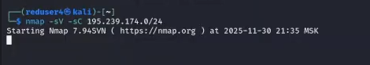

* Сканирование подсети — обнаружена жертва 195.239.174.25.
* Определены открытые порты, включая HTTP.

* На сервере работает WordPress.

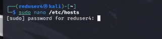

* Добавлен домен portal.ampire.corp в /etc/hosts.

---

## Запуск Metasploit Framework

* Подготовка к использованию модулей для WordPress-плагинов.

---

# Эксплуатация уязвимости WpDiscuz

## WpDiscuz — неаутентифицированная загрузка файла (RCE)

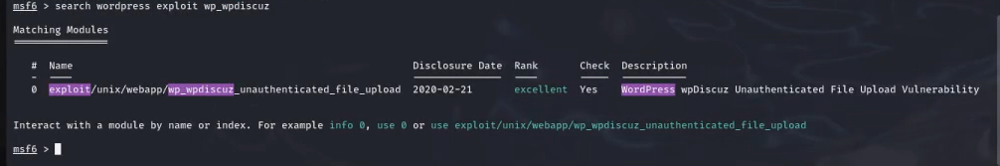

* Поиск модуля в Metasploit.

* Настройка параметров эксплойта.

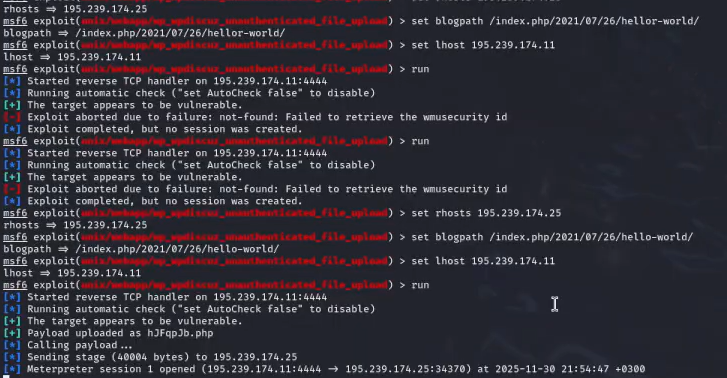

* Выполнение атаки — успешное получение Meterpreter-сессии.

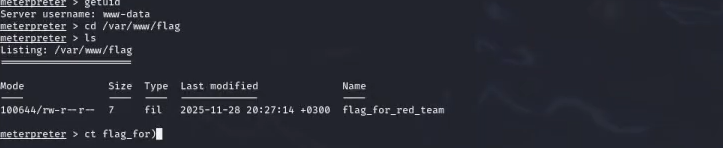

* Навигация по серверу.

* Получение первого флага.

---

# Эксплуатация уязвимости Duplicator

## Duplicator — произвольное чтение файлов

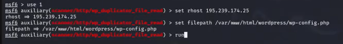

* Чтение wp-config.php через уязвимость.

* Получены реальные учётные данные администратора WordPress.

* Успешная авторизация в админ-панели.

---

# Эксплуатация wp_admin_shell_upload

## Загрузка PHP-бэкдора через админ-панель

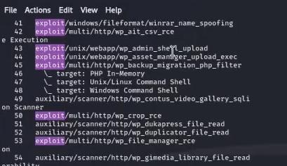

* Выбор соответствующего эксплойта.

* Настройка целевых параметров.

* Указание логина/пароля администратора.

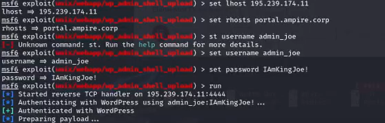

* Успешная эксплуатация и выполнение произвольного кода.

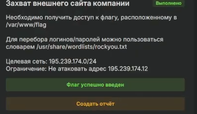

---

# Эксплуатация уязвимости Essential Addons

## Essential Addons — сброс пароля администратора

* Запуск BurpSuite и подготовка перехвата.

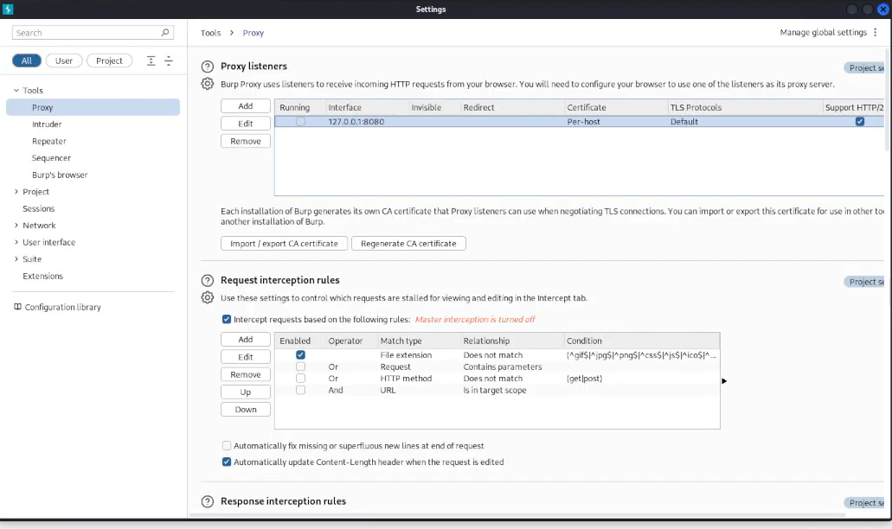

* Настройка прокси-сервера.

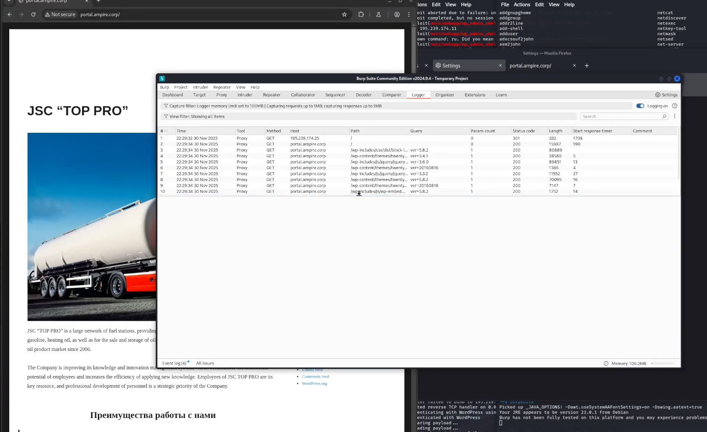
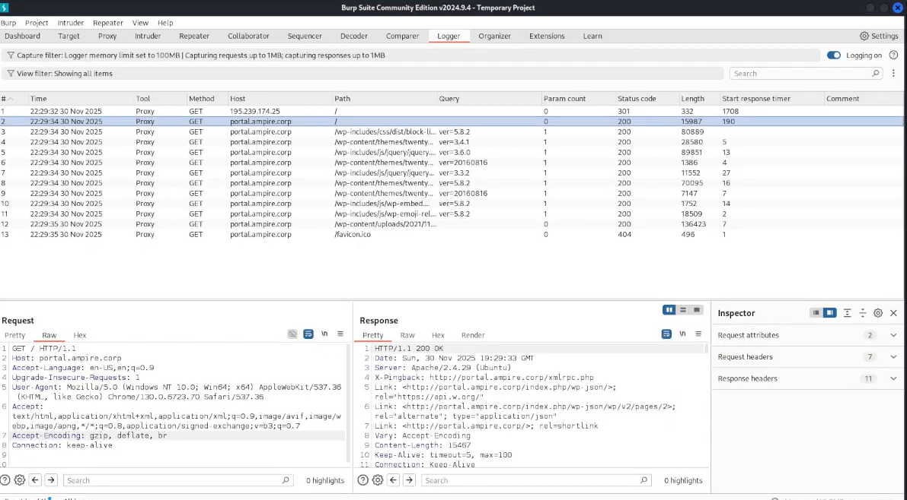

* Анализ HTTP-трафика WordPress.

* Модификация POST-запроса — подмена nonce, widget_id, page_id.  
* Пароль администратора изменён на новый.

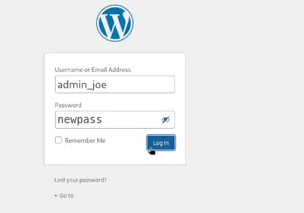

* Успешный вход после сброса.

---

# Результаты

## Итоги работы

* Проведена комплексная атака на WordPress-сайт.
* Получены:
  - неаутентифицированная оболочка через WpDiscuz,
  - административные учётные данные через Duplicator File Read,
  - сброс пароля администратора через Essential Addons,
  - два флага с атакуемого сервера.
* Отработана цепочка атак: разведка → эксплуатация → закрепление → пост-эксплуатация.

## Выводы

* Лабораторная работа показала критическую опасность уязвимых плагинов WordPress.
* Все три эксплуатации предоставили полный контроль над сайтом.
* Получены важные практические навыки работы с Metasploit, BurpSuite и анализом CMS уязвимостей.
* Подобные методики широко применяются в пентесте, Red Teaming и bug hunting.

---

