---
## Author
author:
  name: А. Атанесов, А. Понич, В. Ефремова, А. Касьянов, Б. Тогтохжаф, Д. Дроздова
  affiliation:
    - name: Российский университет дружбы народов
      country: Российская Федерация
      postal-code: 117198
      city: Москва
      address: ул. Миклухо-Маклая, д. 6

## Title
title: "Отчёт по лабораторной работе №5"
subtitle: "Атака на веб-приложение: эксплуатация уязвимостей WordPress"
license: "CC BY"
---

# Цель работы

Получить практические навыки проведения атак на веб-приложение, выполнить разведку, выявить уязвимые компоненты WordPress, осуществить эксплуатацию обнаруженных уязвимостей и получить флаги, расположенные на сервере.

# Задание

1. Провести разведку сети и определить целевой сервер.  
2. Определить уязвимые плагины WordPress.  
3. Последовательно выполнить эксплуатацию трёх уязвимостей:
   - WpDiscuz (unauthenticated RCE),
   - Duplicator (file read vulnerability),
   - Essential Addons for Elementor (password reset).  
4. Получить доступ к системе и извлечь флаг.  
5. Подготовить отчёт о выполненных действиях.

# Теоретическое введение

В ходе наступательных мероприятий (offensive security) специалист анализирует инфраструктуру с позиции злоумышленника. Основные этапы:

- разведка сети (scanning),
- выявление версий сервисов и компонентов,
- подбор эксплуатационных модулей,
- получение несанкционированного доступа,
- закрепление и расширение присутствия,
- извлечение ценной информации (флагов).

В работе используется:

- Nmap — разведка сети и сервисов;
- Metasploit Framework — эксплуатация уязвимостей;
- BurpSuite — анализ и модификация HTTP-запросов;
- WordPress — целевая CMS.

---

# Выполнение лабораторной работы

# 1. Разведка сети (Nmap)

Сканирование подсети:

Обнаружены открытые порты и веб-сервер WordPress:

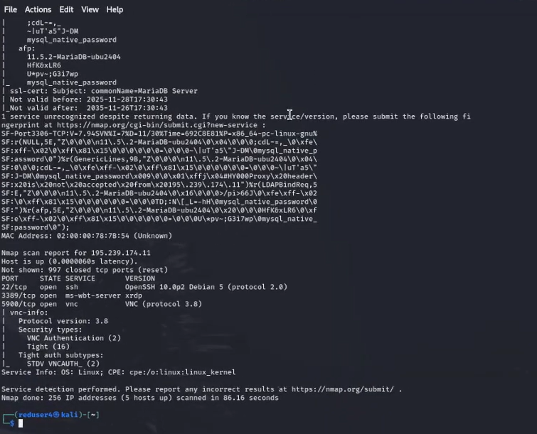

Для удобства взаимодействия добавлен домен:

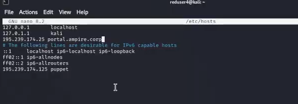

Запуск Metasploit:

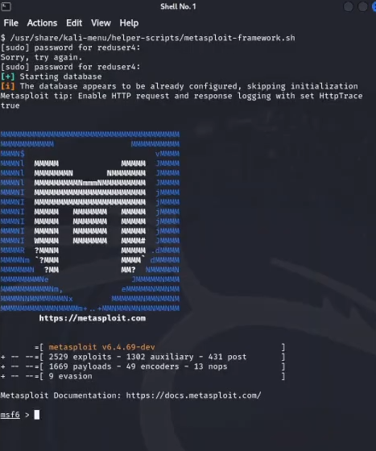

---

# 2. Эксплуатация уязвимости WpDiscuz (unauthenticated file upload → RCE)

Поиск модуля:

Настройка и просмотр параметров:

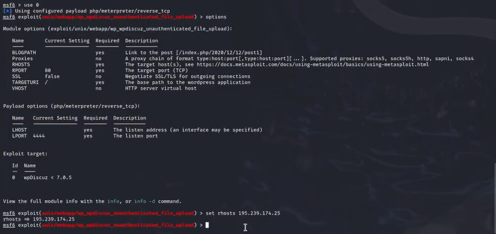

Подбор корректного пути поста, настройка LHOST and RHOST, запуск эксплойта:

Успешное получение Meterpreter-сессии:

Извлечение флага:

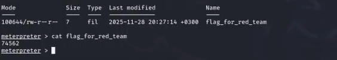

---

# 3. Эксплуатация уязвимости Duplicator (file read vulnerability)

Эксплуатация даёт возможность читать произвольные файлы. Используем её для чтения wp-config.php.

Получение конфиденциальных данных:

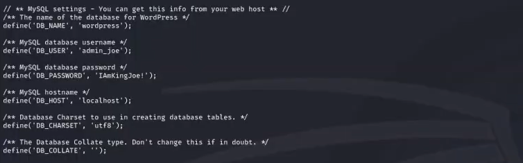

Выделенные данные: admin_joe / IAmKingJoe!

Авторизация в админ-панели WordPress:

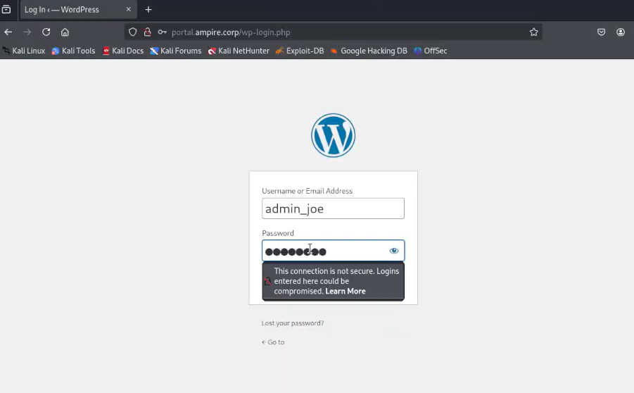

---

# 4. Эксплуатация уязвимости wp_admin_shell_upload

Просмотр списка эксплойтов:

Выбор нужного модуля:

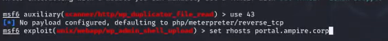

Настройка параметров:

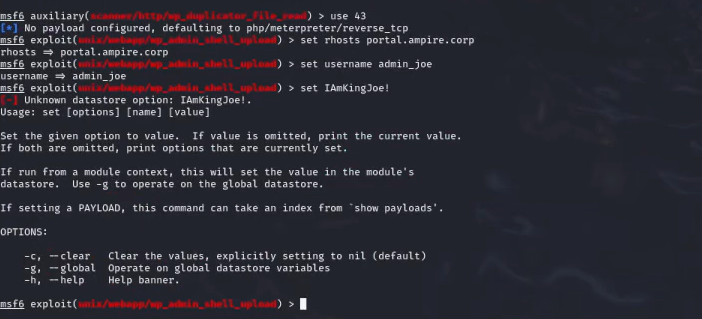

Запуск:

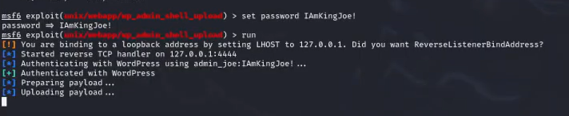

Корректный запуск после настройки LHOST:

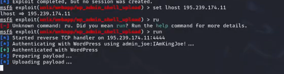

Успешная эксплуатация:

Завершение этапа:

---

# 5. Эксплуатация Essential Addons (Password Reset через BurpSuite)

Запуск BurpSuite:

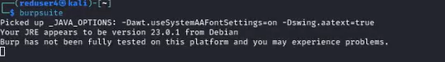

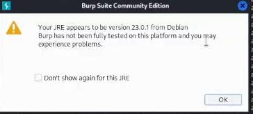

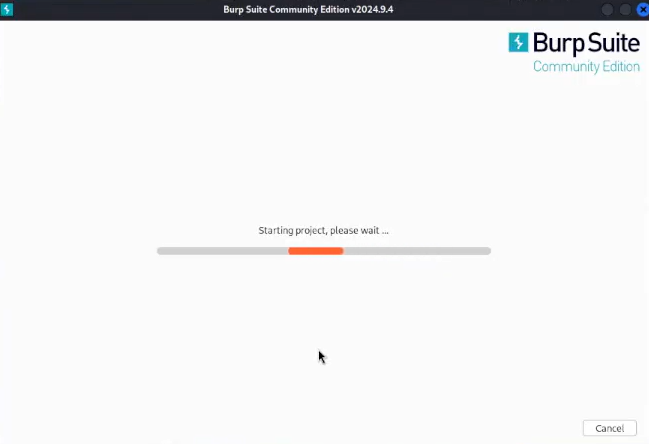

Настройка Proxy:

Настройка Firefox:

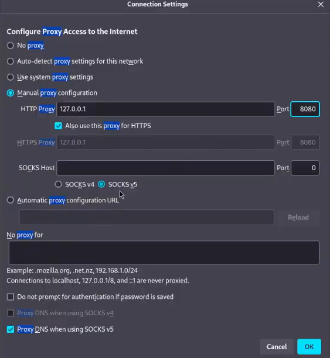

Просмотр перехваченных запросов:

Подмена POST-запроса для сброса пароля:

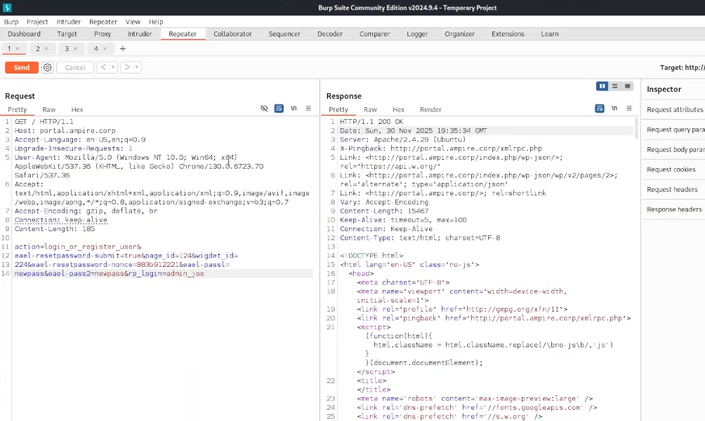

Авторизация под новым паролем:

---

# Выводы

В ходе лабораторной работы была проведена комплексная атака на WordPress-сайт, включающая:

- разведку сети и обнаружение целевого сервера;
- выявление используемых плагинов и их уязвимых версий;
- успешную эксплуатацию трёх различных уязвимостей:
  1. WpDiscuz — загрузка и выполнение вредоносного файла, получение Meterpreter-сессии;
  2. Duplicator — чтение конфигурации и получение учётных данных администратора;
  3. Essential Addons — сброс пароля администратора через уязвимость в обработке POST-запросов;
- получение административного доступа к порталу и извлечение флага.

Работа демонстрирует последовательность действий злоумышленника и процесс эксплуатации реальных уязвимостей CMS WordPress. Полученные навыки важны для понимания методов атак и дальнейшего анализа безопасности веб-приложений.

---
